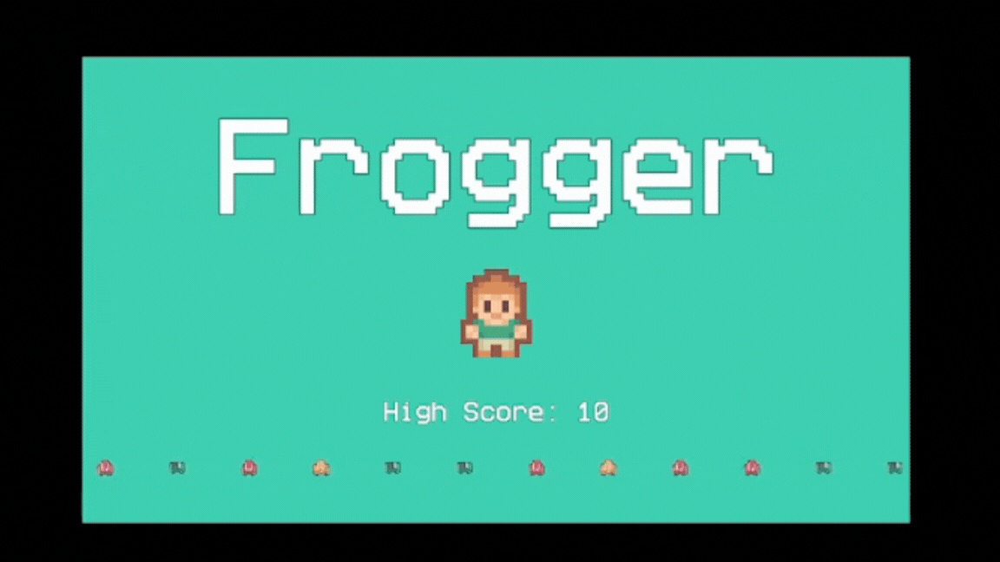

# Frogger (Godot)

A small Godot 4 project inspired by the classic *Frogger* arcade game. The player must navigate through lanes of traffic and reach the opposite side of the road as quickly as possible without getting hit.

## Overview

**Frogger** is a simple arcade-style game focused on timing, risk assessment, and movement precision.

- The player navigates through traffic to reach the far side of the road.
- Successfully reaching the finish line records a score based on completion time and offers the option to restart.
- If the player is hit by a car, they are reset to the starting position and no score is recorded.
- Difficulty ramps as the player progresses, encouraging a balance of patience and aggressive gameplay.

## Key Features

- Basic sprite-based player movement and animations
- Transitioning between a title screen and gameplay scene
- Collision detection using layers and masks (player, traffic, finish line)
- Dynamically increasing traffic difficulty based on player progress
- Traffic speed and spawn frequency randomized using configurable jitter values (tunable per spawn point)
- World boundaries used to manage off-screen despawning of traffic
- Global state and scene transitions managed via autoloads

## Technical Details

- **Engine:** Godot 4.5.1
- **Language:** GDScript
- **Project Type:** Small gameplay prototype / mechanics showcase

## Getting Started

1. Open the project in **Godot 4.5.1**
2. Run the main scene
3. Use directional input to guide the player across traffic and reach the finish line

## Asset Credit

Visual assets used in this project were created by **Chris Koch** and sourced from his publicly shared asset pack:  
https://drive.google.com/file/d/1CVRDb7fmeL2SeBGZVEolStxHLINfcvoS/view
